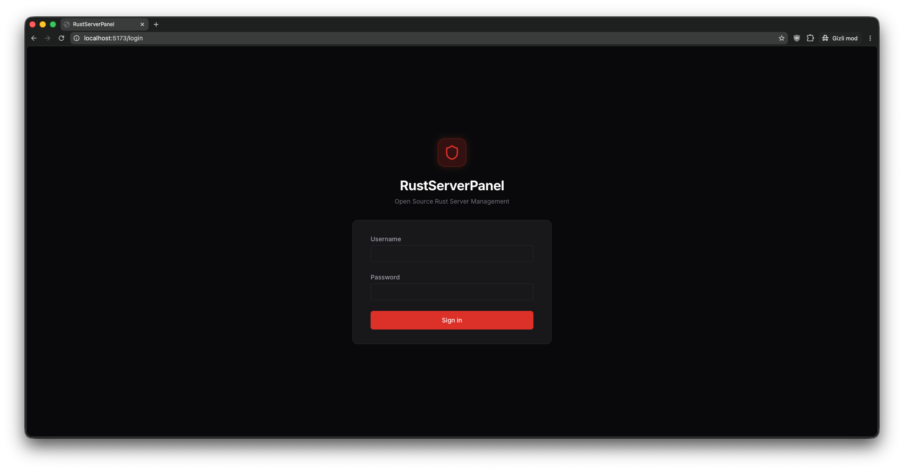
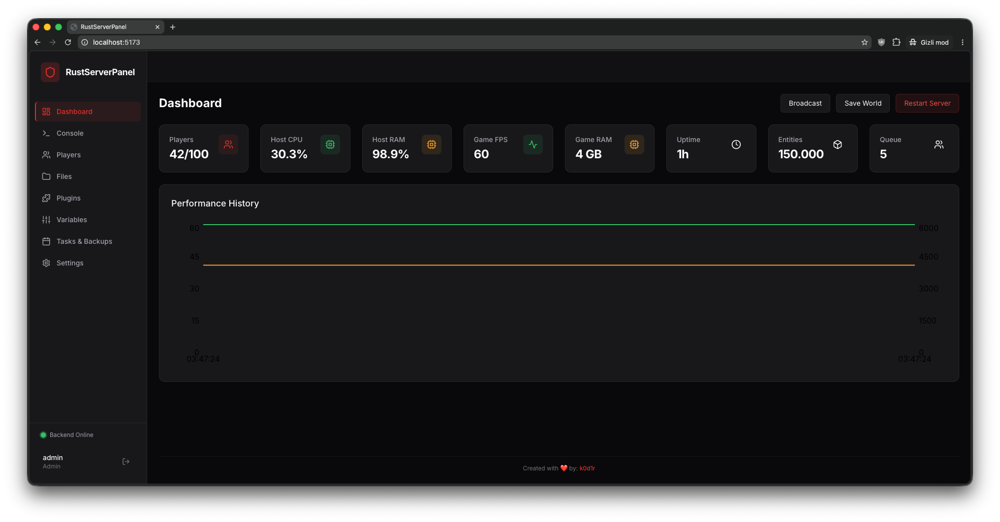
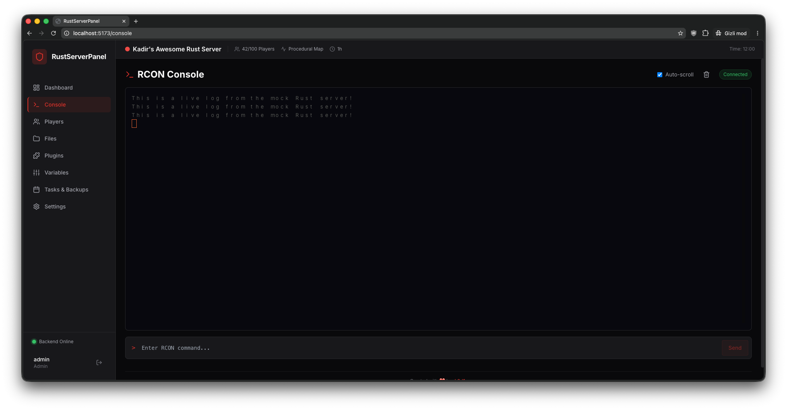
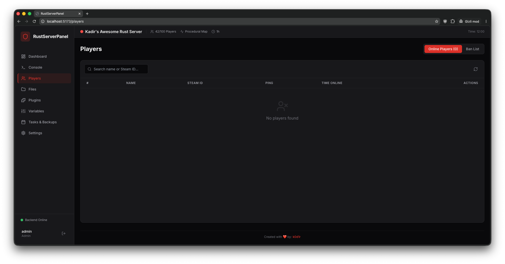
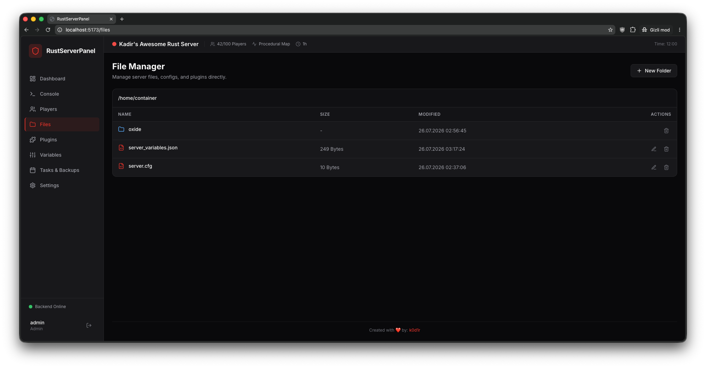
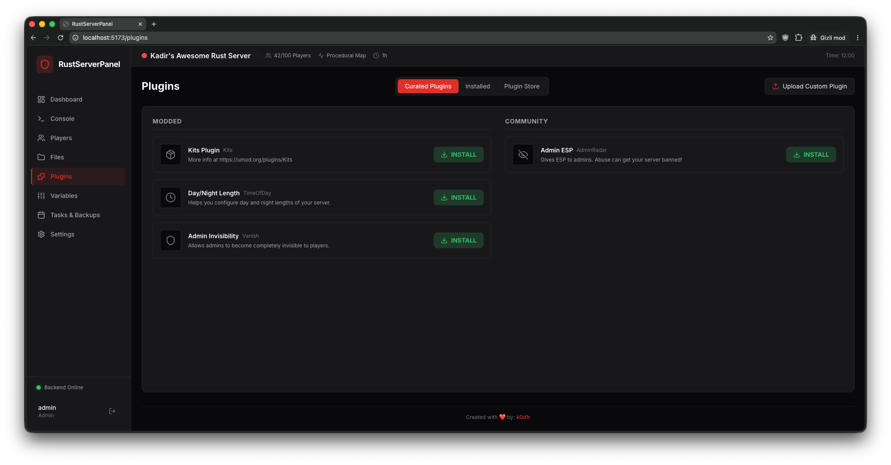
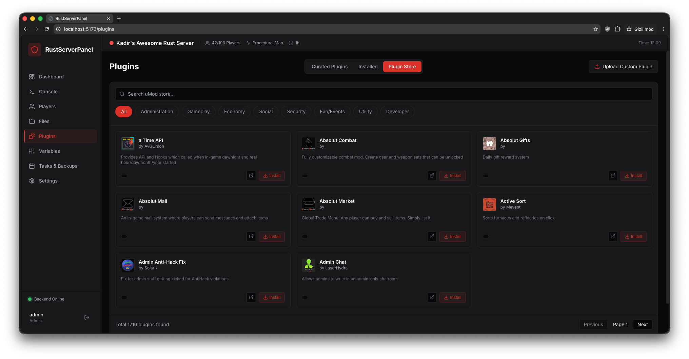
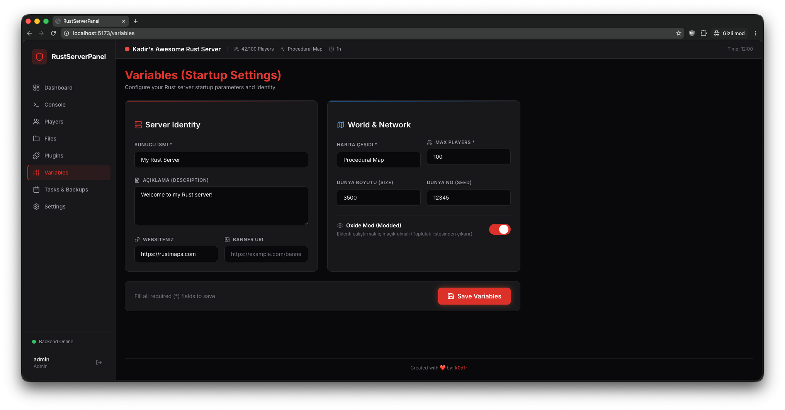
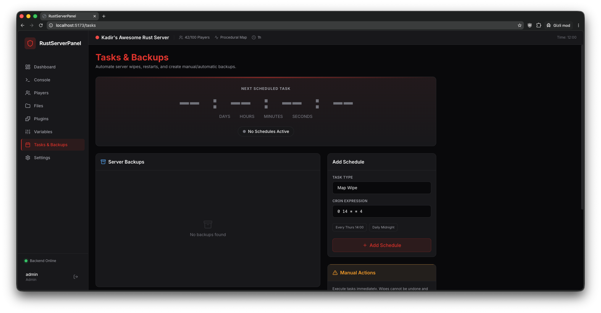
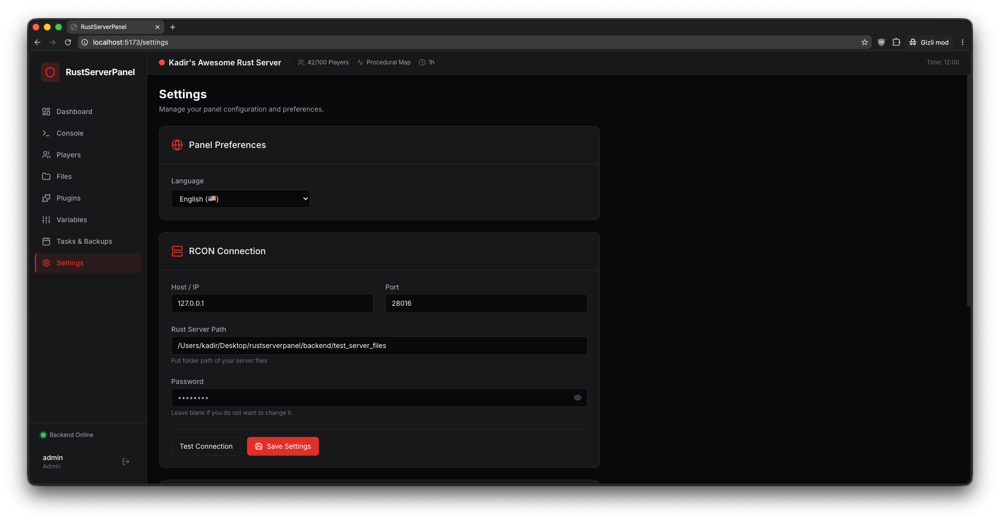

<div align="center">
  
  <h1>RustServerPanel</h1>
  <p><strong>El panel web de código abierto definitivo para servidores de Rust</strong></p>
  
  <p>
    <a href="README.md">🇺🇸 English</a> •
    <a href="README.tr.md">🇹🇷 Türkçe</a> •
    <a href="README.zh.md">🇨🇳 中文</a> •
    <a href="README.es.md">🇪🇸 Español</a> •
    <a href="README.ru.md">🇷🇺 Русский</a> •
    <a href="README.de.md">🇩🇪 Deutsch</a>
  </p>

  
  <p>
    <a href="https://github.com/k0d1r/rustserverpanel/issues"></a>
    <a href="https://github.com/k0d1r/rustserverpanel/network/members"></a>
    <a href="https://github.com/k0d1r/rustserverpanel/stargazers"></a>
    <a href="https://github.com/k0d1r/rustserverpanel/blob/main/LICENSE"></a>
  </p>

</div>

## 📖 Descripción general

**RustServerPanel** es un panel de gestión de servidores de juegos moderno, de alto rendimiento y totalmente de código abierto, diseñado específicamente para **Rust**. Diseñado para reemplazar los pesados paneles comerciales, se conecta a través de **WebRCON** para ofrecer un control en tiempo real sobre el servidor, los plugins y los jugadores.

## ✨ Características clave

- 🚀 **Consola WebRCON en tiempo real**: Terminal integrado con resaltado de sintaxis y sin latencia.
- 👥 **Gestión avanzada de jugadores**: Seguimiento en vivo, expulsiones/baneos con un solo clic.
- 🧩 **Gestor de plugins con 1 clic**: Integración con uMod/Oxide para instalar y actualizar plugins.
- ⚙️ **Editor de variables (Convars)**: Edita la configuración JSON del servidor de forma segura.
- 💾 **Limpiezas y copias de seguridad (Wipes)**: Programa Wipes completos, de mapas y backups ZIP automáticos con Cron.
- 🌐 **Multilingüe**: Soporte nativo para 6 idiomas.

## 📦 Guía de instalación
```bash
git clone https://github.com/k0d1r/rustserverpanel.git
cd rustserverpanel/backend
npm install && npm run build && npm start
```
*Usuario por defecto: `admin`, Contraseña: `admin123`*

## 📸 Capturas de pantalla


<div align="center">
  
  <br/><br/>
  
  <br/><br/>
  
  <br/><br/>
  
  <br/><br/>
  
  <br/><br/>
  
  <br/><br/>
  
  <br/><br/>
  
  <br/><br/>
  
  <br/><br/>
  
</div>


---
**SEO Keywords**: Rust Server Panel, Servidor Rust, Rust RCON Español, Panel de Administración Rust, Oxide Admin, uMod Manager.

<div align="center">
  <i>Creado con ❤️ por <a href="https://github.com/k0d1r">k0d1r</a></i>
</div>